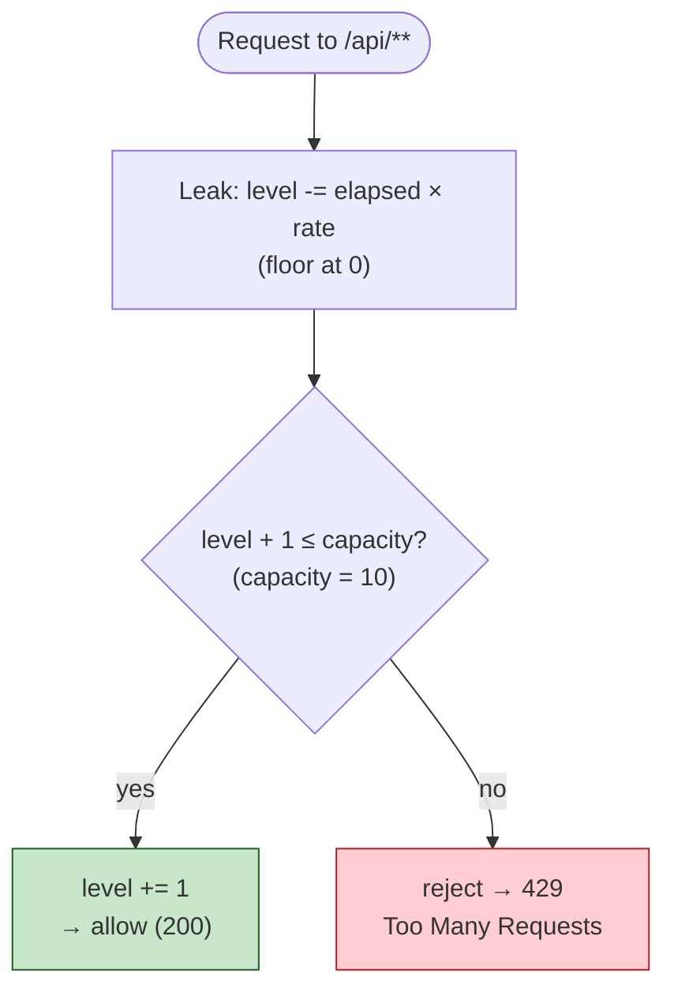

# Leaky Bucket Rate Limiter — Design & Implementation Plan

## 1. What the assignment asks for

- Process-local (in-memory, single process) — **no Redis/distributed state**.
- **Global** limit — one shared bucket for *all* clients, not per-IP/per-token.
- **10 requests / minute**.
- Clean, readable, maintainable; tests + docs.

## 2. Leaky Bucket, the two variants

The "leaky bucket" name covers two closely related models:

1. **Leaky bucket as a queue (meter/shaper).** Requests enter a FIFO queue (the bucket).
   They *leak out* (are processed) at a fixed rate. If the bucket is full, new requests
   are dropped/rejected. This *smooths* bursts into a constant output rate.
2. **Leaky bucket as a counter (the common web-rate-limit form).** A counter represents
   the current "water level." Each request adds 1 unit. The bucket leaks continuously at
   a constant rate (capacity / period). If adding 1 would overflow capacity, reject.

For an HTTP rate limiter we want variant **2** (the counter form) — it's the standard,
allocation-free, O(1) approach and maps directly to "N requests per minute."



One shared, mutex-guarded bucket serves all clients (the global limit). Steps below.

### Chosen model (counter form)

- `capacity = 10` (max water the bucket holds → burst ceiling).
- `leakRatePerSecond = capacity / 60 = 10/60 ≈ 0.1667` units/sec.
- On each request:
  1. Compute elapsed time since last update; leak `elapsed * leakRate` units (floor the
     level at 0).
  2. If `level + 1 <= capacity`: accept, `level += 1`.
  3. Else: reject with **HTTP 429 Too Many Requests**.
- One shared instance guarded by a mutex → satisfies "global across all clients."

This allows a burst of up to 10 immediately, then drips back one slot roughly every 6s,
averaging 10/min. (We'll note the alternative "strict fixed window" behavior in the doc
and explain why leaky bucket's smoothing is preferable.)

### TypeScript equivalent (mental model)

The same counter form in idiomatic TS, with the clock injected for deterministic tests:

```ts
type Clock = () => number; // epoch millis

export class LeakyBucket {
  private level = 0;
  private last: number;

  constructor(
    private readonly capacity: number,   // 10
    private readonly ratePerMs: number,  // capacity / 60_000  (leak per ms)
    private readonly now: Clock = Date.now,
  ) {
    this.last = now();
  }

  /** Consumes one slot and returns true if the request is allowed. */
  tryAcquire(): boolean {
    const t = this.now();
    this.level = Math.max(0, this.level - (t - this.last) * this.ratePerMs);
    this.last = t;
    if (this.level + 1 <= this.capacity) {
      this.level += 1;
      return true;
    }
    return false;
  }
}
```

**Key concurrency difference vs. Go/Java.** Go serves each request on its own goroutine and
Java on its own Tomcat worker thread, so the shared bucket **must** be guarded by a
`sync.Mutex` / lock. Node.js runs a **single-threaded event loop**, so `tryAcquire()` — being
fully synchronous with no `await` between the read and the write — runs to completion without
interleaving. **No lock is needed** as long as that method never becomes `async`. That's the TS
mental model: the event loop *is* your mutex, but only across synchronous sections.

## 3. Where it plugs in

- **Go:** a middleware wrapping the API mux — see `docs/architecture-go.md` (§ request
  pipeline). Returns 429 before the handler runs.
- **Java:** a servlet `Filter` (or `HandlerInterceptor`) registered globally — see
  `docs/architecture-java.md`.
- **TypeScript (equivalent):** the limit is **global**, so the app must hold exactly one
  bucket — the TS design has to enforce that, the same way Go creates it once in `NewRouter`
  and Java registers a single `@Component` bean. Split the two concerns:

  **1. Mechanism** (`leaky-bucket.ts`) — the `LeakyBucket` class above stays freely
  constructable, but *only so unit tests can spin up isolated instances with a fake clock*.
  App code never imports it directly.

  **2. App-wide singleton** (`rate-limiter.ts`) — construct the one shared bucket here and
  export only the middleware. Node caches modules, so this instance is created once and every
  importer shares it; because the class isn't re-exported, app code *cannot* `new` its own:
  ```ts
  import { LeakyBucket } from "./leaky-bucket";

  const bucket = new LeakyBucket(10, 10 / 60_000); // the ONE global bucket

  export const rateLimit: RequestHandler = (_req, res, next) =>
    bucket.tryAcquire() ? next() : res.status(429).json({ error: "rate limit exceeded" });
  // app.use("/api", rateLimit) → scoped to /api, so /health stays exempt (mirrors Go/Java).
  ```
  Fastify would be the analogous `preHandler` hook on the `/api` scope.

  If you want the singleton enforced *within one module* too (not just by import discipline),
  a private-constructor + static accessor makes a second instance impossible:
  ```ts
  export class GlobalRateLimiter {
    private static instance?: GlobalRateLimiter;
    private constructor(private readonly bucket: LeakyBucket) {}
    static get(): GlobalRateLimiter {
      return (this.instance ??= new GlobalRateLimiter(new LeakyBucket(10, 10 / 60_000)));
    }
    tryAcquire(): boolean { return this.bucket.tryAcquire(); }
  }
  ```
  Trade-off: the static form bakes in the clock/config at first call, which hurts
  testability — that's why the **module-singleton + separately-testable class** (above) is
  usually the cleaner choice, and it's the closest analog to how Go and Java wire the single
  instance at composition time.

_(Exact file/line insertion points filled in from the architecture docs.)_

## 4. Red → Green implementation plan (single small commits)

Each numbered item = one failing-test commit followed by one make-it-pass commit.

1. **Core limiter unit tests** (no HTTP):
   - allows the first 10 requests, rejects the 11th within the same minute.
   - after leaking (advance a fake clock), a slot frees up and the next request is allowed.
   - concurrency: N goroutines/threads hammering the limiter never exceed capacity.
     _(TS: less relevant given the single-threaded loop — instead assert a tight synchronous
     loop of 11 calls yields exactly 10 `true` then `false`.)_
   - Inject a clock (function/interface) so time is deterministic in tests — **no `sleep`**.
     _(Go: a `func() time.Time`; Java: a `Clock`/`Supplier<Instant>`; TS: a `() => number`, or
     Jest fake timers — pass a stub `now` so time is advanced explicitly.)_
2. **Config**: limit expressed as `capacity=10, per=1 minute`, easy to change in one place.
3. **HTTP integration**: middleware/filter returns 429 with a sensible body/headers once
   the global limit is exceeded; health check (`/health`) behavior decided (likely exempt).
4. **Wire into the app** and add an end-to-end test hitting the real routes.
5. **Docs**: short README section on the limiter + tuning knobs.

## 5. Decisions (confirmed)

- **Scope: both Go and Java.** Implement the limiter in both stacks with identical behavior;
  each gets its own red→green commit sequence.
- **`/health` is exempt.** The bucket only applies to `/api/**`, so health checks never trip
  the limit. Concretely: Go → add the middleware inside the `r.Route("/api", ...)` subtree
  (not the top-level chain); Java → `HandlerInterceptor` scoped to `/api/**`, or a
  `Filter` that skips paths not under `/api/`.

### Still to confirm (lower stakes, can decide at implementation time)

- Response on limit: plain **429** body; optionally add `Retry-After` / `X-RateLimit-*`
  headers (nice-to-have, not required).
- Bursting: leaky-bucket smoothing allows an initial burst of 10 then drips ~1 slot / 6s.
  We'll go with this (standard leaky-bucket behavior) unless a strict fixed window is wanted.
